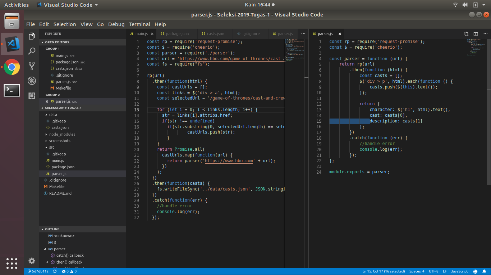

<h1 align="center">
  <br>
  Seleksi 1 Warga Basdat 2019
  <br>
  <br>
</h1>

<h2 align="center">
  <br>
  Data Scraping
  <br>
  <br>
</h2>

## Description
Sebagai series yang paling populer, tentunya Game of Thrones memiliki fans fanatik yang sering kali mencari segala data yang memiliki hubungan dengan series tersebut. 

## How to use
Jalankan script berikut pada CLI:
```
$ cd src
$ npm install
$ npm run start
```

## Ideas and innovations in utilizing the data
Data-data yang berhubungan dengan series ini dapat disimpan didalam sebuah website fandom. Dengan salah satunya merupakan data cast pemain dari Game of Thrones.

## JSON Structure
```
    {
        "character": "Eddard “Ned” Stark",
        "cast": "Played by  Sean Bean",
        "description": "Lord of Winterfell and Warden of the North. The childhood friend of Robert Baratheon, he was a key player in Robert's rebellion, helping him win the throne from the Targaryens. He is married to Catelyn Tully.\n"
    }
```

## Screenshot program



## References
Script ini menggunakan library:
1. [Node JS](https://nodejs.org)
3. [Cheerio](https://github.com/cheeriojs/cheerio)
4. [Request-Promise](https://github.com/request/request-promise)

## Author
Rakhmad Budiono / 13517151